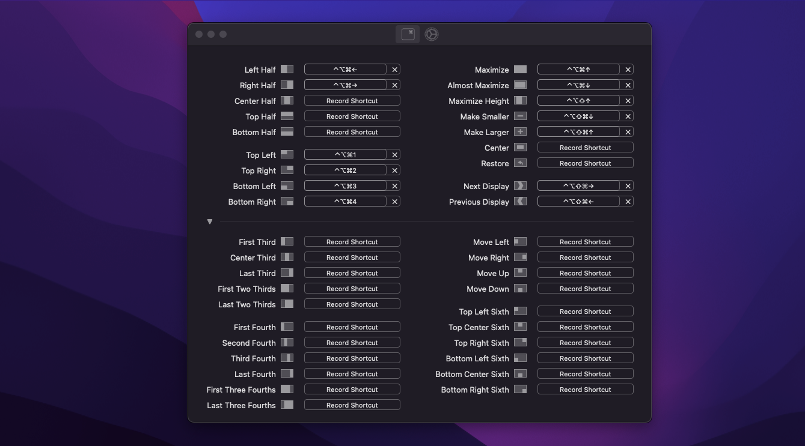

# My Shortcut Cheatsheet

## Prerequisites

1. Set up Hyper key on MacOS with Karabiner Elements.
   - Caps Lock = Control + Option + Command

## Window Navigation

### Windows

| Action             | Shortcut          |
| ------------------ | ----------------- |
| Snap to left half  | Win + left arrow  |
| Snap to right half | Win + right arrow |
| Maximise window    | Win + up arrow    |
| Restore down       | Win + down arrow  |

Other combinations like snap to top left quarter of screen or move window to secondary display or minimize window can be easily achieved by combining the above actions.

### MacOS

_fulfilled by Karabiner-Elements.app + Rectangle.app_

| Action                   | Shortcut                    |
| ------------------------ | --------------------------- |
| Snap to left half        | Hyper + left arrow          |
| Snap to right half       | Hyper + right arrow         |
| Move to next display     | Hyper + shift + left arrow  |
| Move to previous display | Hyper + shift + right arrow |
| Maximise window          | Hyper + up arrow            |
| Restore down             | Hyper + down arrow          |
| Make larger              | Hyper + shift + up arrow    |
| Make smaller             | Hyper + shift + down arrow  |

---

| Action                       | Shortcut  |
| ---------------------------- | --------- |
| Snap to top left quarter     | Hyper + 1 |
| Snap to top right quarter    | Hyper + 2 |
| Snap to bottom left quarter  | Hyper + 3 |
| Snap to bottom right quarter | Hyper + 4 |

## Clipboard Manager

### Windows

| Action                   | Shortcut |
| ------------------------ | -------- |
| Access Clipboard History | Win + v  |

### MacOS

_fulfilled by Flycut.app_

| Action                   | Shortcut  |
| ------------------------ | --------- |
| Access Clipboard History | Hyper + v |

_ Alternatively, [Clipbot.app](https://github.com/codeshifu/clipbot)_

| Action                   | Shortcut        |
| ------------------------ | --------------- |
| Access Clipboard History | Cmd + Shift + c |

## App Launch Shortcuts

### Windows

| Action             | Shortcut |
| ------------------ | -------- |
| Open File Explorer | Win + e  |

### MacOS

_fulfilled by Karabiner-Elements.app + Hammerspoon.app_

| Action      | Shortcut          |
| ----------- | ----------------- |
| Open Finder | Hyper + Shift + e |

### Additional Shortcuts

_fulfilled by Karabiner-Elements.app + Hammerspoon.app_

| Action                          | Shortcut          |
| ------------------------------- | ----------------- |
| Open AWS VPN Client             | Hyper + Shift + A |
| Open Google Calendar Chrome App | Hyper + Shift + c |
| Open MySQLWorkbench             | Hyper + Shift + d |
| Open Gmail Chrome App           | Hyper + Shift + g |
| Open Notes                      | Hyper + Shift + n |
| Open Postman                    | Hyper + Shift + p |
| Open Slack                      | Hyper + Shift + s |
| Open Microsoft Remote Desktop   | Hyper + Shift + z |
